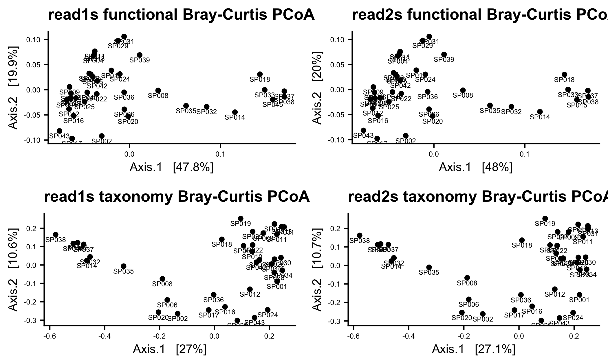
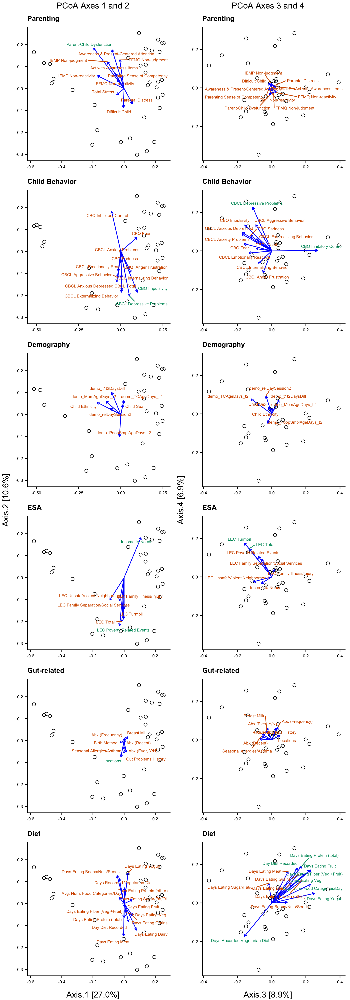
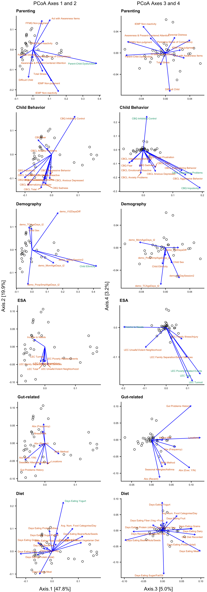
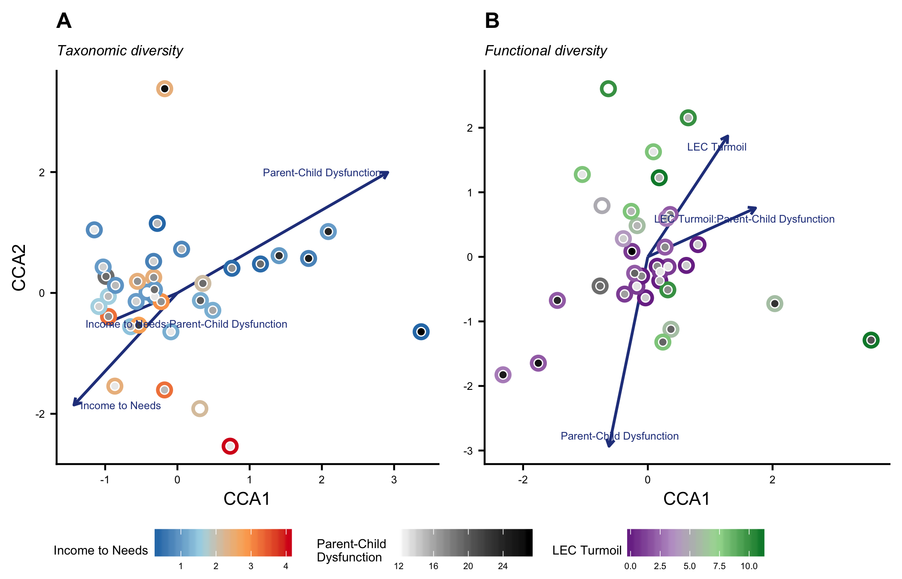

## Setup


## 1. KOs and taxonomic PCoA ordinations

The four PCoA ordinations below represent represent the Bray-Curtis distances for the stool samples based on the forward read data (read1s, plots on left), the reverse read data (read2s; plots on right). The distances were computed for their functional diversity (`shotmap`; KEGG Orthologies; plots on top) and taxonomic diversity (`metaphlan2`; plots on bottom).

<!-- -->

## 2. KOs vs taxonomic Procrustes analyses

To infer whether there's a significant relationship between taxonomic and functional composition/diversity (as implied by that telling cluster of samples mentioned above), we ran a Procrustes analysis (`protest`{`vegan`}) comparing the functional and taxonomic ordinations for both forward and reverse reads sets. We also looked at the correlation between reads 1 and 2 within functional and taxonomic diversity. 


```
## 
## Call:
## protest(X = ord.list[["kos-1"]]$vectors, Y = ord.list[["kos-2"]]$vectors,      permutations = 9999) 
## 
## Procrustes Sum of Squares (m12 squared):        0.0006204 
## Correlation in a symmetric Procrustes rotation: 0.9997 
## Significance:  1e-04 
## 
## Permutation: free
## Number of permutations: 9999
```

```
## 
## Call:
## protest(X = ord.list[["tax-1"]]$vectors, Y = ord.list[["tax-2"]]$vectors,      permutations = 9999) 
## 
## Procrustes Sum of Squares (m12 squared):        0.005434 
## Correlation in a symmetric Procrustes rotation: 0.9973 
## Significance:  1e-04 
## 
## Permutation: free
## Number of permutations: 9999
```

```
## 
## Call:
## protest(X = ord.list[["kos-1"]]$vectors, Y = ord.list[["tax-1"]]$vectors,      permutations = 9999) 
## 
## Procrustes Sum of Squares (m12 squared):        0.2986 
## Correlation in a symmetric Procrustes rotation: 0.8375 
## Significance:  1e-04 
## 
## Permutation: free
## Number of permutations: 9999
```

```
## 
## Call:
## protest(X = ord.list[["kos-2"]]$vectors, Y = ord.list[["tax-2"]]$vectors,      permutations = 9999) 
## 
## Procrustes Sum of Squares (m12 squared):        0.3004 
## Correlation in a symmetric Procrustes rotation: 0.8364 
## Significance:  1e-04 
## 
## Permutation: free
## Number of permutations: 9999
```

<table class="table table-hover table-condensed" style="width: auto !important; margin-left: auto; margin-right: auto;">
 <thead>
  <tr>
   <th style="text-align:center;"> read.comp </th>
   <th style="text-align:center;"> type.comp </th>
   <th style="text-align:right;"> R2 </th>
   <th style="text-align:right;"> sig </th>
  </tr>
 </thead>
<tbody>
  <tr>
   <td style="text-align:center;vertical-align: middle !important;" rowspan="2"> 1 vs. 2 </td>
   <td style="text-align:center;"> KOs vs. KOs </td>
   <td style="text-align:right;"> 0.9997 </td>
   <td style="text-align:right;"> 1e-04 </td>
  </tr>
  <tr>
   
   <td style="text-align:center;"> Taxa vs. Taxa </td>
   <td style="text-align:right;"> 0.9973 </td>
   <td style="text-align:right;"> 1e-04 </td>
  </tr>
  <tr>
   <td style="text-align:center;"> 1 vs. 1 </td>
   <td style="text-align:center;vertical-align: middle !important;" rowspan="2"> KOs vs. Taxa </td>
   <td style="text-align:right;"> 0.8375 </td>
   <td style="text-align:right;"> 1e-04 </td>
  </tr>
  <tr>
   <td style="text-align:center;"> 2 vs. 2 </td>
   
   <td style="text-align:right;"> 0.8364 </td>
   <td style="text-align:right;"> 1e-04 </td>
  </tr>
</tbody>
</table>

## 3. Variable selection

There are 58 meta-data covariates associated with these microbiome samples. In order to determine which of these variables are most important in influencing the diversity and composition of the microbiomes we ran a set of data reduction steps. We grouped the covariates into 5 categories: Child Behavior, Parenting, Environmental and Social Adveristy (ESA), Demography, and Gut-related. The last two categories contained covariates (such as age, ethnicity, and antibiotic use) that we know can influence the microbiome but that were not the focus of this particular study. Therefore, in subsequent analyes, we first accounted for the effects of the Demographic and Gut-related covariates that most strongly associated with the microbiome before the assessing the associations of the covariates within other categories,.

### Envfit

As a first passs to see which covariates within each category most strongly associated with the microbiome compostion, I applied the function `envfit`{`vegan`} to the same PCoA ordinations produced above (we ran two tests for each covariate category, using the 1st and 2nd PCoA axes, and then the third and fourth). Covariates that were deemed significant are colored in green, non-significant in red. 


```
## Significant terms based on functional composition
```

```
## $parent_
## [1] "Parent-Child Dysfunction"
## 
## $child_behav_
## [1] "CBQ Impulsivity"          "CBQ Inhibitory Control"  
## [3] "CBCL Depressive Problems"
## 
## $demo_
## [1] "Child Ethnicity"
## 
## $esa_
## [1] "LEC Poverty Related Events " "LEC Turmoil"                
## [3] "LEC Total"                   "Income to Needs"            
## 
## $gut_
## character(0)
## 
## $Diet_
## [1] "Days Eating Yogurt"
```

```
## Significant terms based on taxonomic composition
```

```
## $parent_
## [1] "Parent-Child Dysfunction"
## 
## $child_behav_
## [1] "CBQ Inhibitory Control"   "CBQ Impulsivity"         
## [3] "CBCL Depressive Problems"
## 
## $demo_
## character(0)
## 
## $esa_
## [1] "LEC Turmoil"                 "LEC Poverty Related Events "
## [3] "Income to Needs"             "LEC Total"                  
## 
## $gut_
## [1] "Locations"
## 
## $Diet_
## [1] "Days Eating Fruit"              "Days Eating Fiber (Veg.+Fruit)"
## [3] "Days Eating Protein (total)"    "Days Eating Yogurt"            
## [5] "Avg. Num. Food Categories/Day"  "Days Eating Veg."              
## [7] "Days Recorded Vegetarian Diet"  "Day Diet Recorded"
```

#### Taxonomic Diversity

<!-- -->

#### Functional Diversity

<!-- -->

## 4. Constrained coorespondence analysis

For the following analyses, we used a constrained coorespondence analysis (CCA) followed by PERMANOVA to test our hypotheses regarding the relationship between the selected covariates and the microbiome. We used CCA because it allows us to account for the variance explained by Demographic and Gut-related covariates (which we know from previous research may have an important effect, but we don't want to focus on here), and then test the relationships of our selected covariates and the remaining variance.

###  ESA by Parenting


Here, we generated an original model with the form: `distance matrix ~ (esa_var1 + esa_var2 + ...) * (parent_var1 + parent_var2 + ...)` and then ran `ordistep` on this model to select for the best main effects and interaction terms.


```
## Permutation test for cca under reduced model
## Terms added sequentially (first to last)
## Permutation: free
## Number of permutations: 9999
## 
## Model: cca(formula = var.comm ~ esa_income_to_needs + parent_PSI_PC_dysfunc_t1 + esa_income_to_needs:parent_PSI_PC_dysfunc_t1 + Condition(gut_Locations + Diet_Fruit + Diet_num_fiber + Diet_protein_total + Diet_yogurt + Diet_number_foods_day_sample + Diet_Veg + Diet_vegetarian + Diet_num_days_diet_recorded), data = var.data)
##                                              Df ChiSquare      F Pr(>F)  
## esa_income_to_needs                           1   0.15614 1.2092 0.2070  
## parent_PSI_PC_dysfunc_t1                      1   0.23494 1.8195 0.0131 *
## esa_income_to_needs:parent_PSI_PC_dysfunc_t1  1   0.23497 1.8197 0.0162 *
## Residual                                     22   2.84074                
## ---
## Signif. codes:  0 '***' 0.001 '**' 0.01 '*' 0.05 '.' 0.1 ' ' 1
## Permutation test for cca under reduced model
## Terms added sequentially (first to last)
## Permutation: free
## Number of permutations: 9999
## 
## Model: cca(formula = var.comm ~ esa_LEC_Pov_Combined + esa_LEC_Turmoil_Combined + parent_PSI_PC_dysfunc_t1 + esa_LEC_Pov_Combined:parent_PSI_PC_dysfunc_t1 + esa_LEC_Turmoil_Combined:parent_PSI_PC_dysfunc_t1 + Condition(demo_ETHNICTCnew + Diet_yogurt), data = var.data)
##                                                   Df ChiSquare      F Pr(>F)   
## esa_LEC_Pov_Combined                               1  0.003219 1.0394 0.3588   
## esa_LEC_Turmoil_Combined                           1  0.004022 1.2988 0.1939   
## parent_PSI_PC_dysfunc_t1                           1  0.004999 1.6141 0.0910 . 
## esa_LEC_Pov_Combined:parent_PSI_PC_dysfunc_t1      1  0.005434 1.7546 0.0697 . 
## esa_LEC_Turmoil_Combined:parent_PSI_PC_dysfunc_t1  1  0.008736 2.8210 0.0059 **
## Residual                                          25  0.077422                 
## ---
## Signif. codes:  0 '***' 0.001 '**' 0.01 '*' 0.05 '.' 0.1 ' ' 1
```

Model: cca(formula = var.comm ~ esa_income_to_needs + parent_PSI_PC_dysfunc_t1 + esa_income_to_needs:parent_PSI_PC_dysfunc_t1 + Condition(gut_Locations + Diet_Fruit + Diet_num_fiber + Diet_protein_total + Diet_yogurt + Diet_number_foods_day_sample + Diet_Veg + Diet_vegetarian + Diet_num_days_diet_recorded), data = var.data)
<table class="table table-striped table-hover table-condensed" style="width: auto !important; margin-left: auto; margin-right: auto;">
<caption>Taxonomic diversity</caption>
 <thead>
  <tr>
   <th style="text-align:right;"> covar </th>
   <th style="text-align:right;"> Df </th>
   <th style="text-align:right;"> ChiSquare </th>
   <th style="text-align:right;"> F </th>
   <th style="text-align:right;"> Pr(&gt;F) </th>
   <th style="text-align:left;"> sig </th>
  </tr>
 </thead>
<tbody>
  <tr>
   <td style="text-align:right;border-right:1px solid;"> Income to Needs </td>
   <td style="text-align:right;"> 1 </td>
   <td style="text-align:right;"> 0.156 </td>
   <td style="text-align:right;"> 1.209 </td>
   <td style="text-align:right;"> 0.207 </td>
   <td style="text-align:left;">  </td>
  </tr>
  <tr>
   <td style="text-align:right;border-right:1px solid;"> Parent-Child Dysfunction </td>
   <td style="text-align:right;"> 1 </td>
   <td style="text-align:right;"> 0.235 </td>
   <td style="text-align:right;"> 1.819 </td>
   <td style="text-align:right;"> 0.013 </td>
   <td style="text-align:left;"> * </td>
  </tr>
  <tr>
   <td style="text-align:right;border-right:1px solid;"> Income to Needs:Parent-Child Dysfunction </td>
   <td style="text-align:right;"> 1 </td>
   <td style="text-align:right;"> 0.235 </td>
   <td style="text-align:right;"> 1.820 </td>
   <td style="text-align:right;"> 0.016 </td>
   <td style="text-align:left;"> * </td>
  </tr>
  <tr>
   <td style="text-align:right;border-right:1px solid;"> Residual </td>
   <td style="text-align:right;"> 22 </td>
   <td style="text-align:right;"> 2.841 </td>
   <td style="text-align:right;"> NA </td>
   <td style="text-align:right;"> NA </td>
   <td style="text-align:left;">  </td>
  </tr>
</tbody>
</table>

Model: cca(formula = var.comm ~ esa_LEC_Pov_Combined + esa_LEC_Turmoil_Combined + parent_PSI_PC_dysfunc_t1 + esa_LEC_Pov_Combined:parent_PSI_PC_dysfunc_t1 + esa_LEC_Turmoil_Combined:parent_PSI_PC_dysfunc_t1 + Condition(demo_ETHNICTCnew + Diet_yogurt), data = var.data)
<table class="table table-striped table-hover table-condensed" style="width: auto !important; margin-left: auto; margin-right: auto;">
<caption>Functional diversity</caption>
 <thead>
  <tr>
   <th style="text-align:right;"> covar </th>
   <th style="text-align:right;"> Df </th>
   <th style="text-align:right;"> ChiSquare </th>
   <th style="text-align:right;"> F </th>
   <th style="text-align:right;"> Pr(&gt;F) </th>
   <th style="text-align:left;"> sig </th>
  </tr>
 </thead>
<tbody>
  <tr>
   <td style="text-align:right;border-right:1px solid;"> LEC Poverty Related Events </td>
   <td style="text-align:right;"> 1 </td>
   <td style="text-align:right;"> 0.003 </td>
   <td style="text-align:right;"> 1.039 </td>
   <td style="text-align:right;"> 0.359 </td>
   <td style="text-align:left;">  </td>
  </tr>
  <tr>
   <td style="text-align:right;border-right:1px solid;"> LEC Turmoil </td>
   <td style="text-align:right;"> 1 </td>
   <td style="text-align:right;"> 0.004 </td>
   <td style="text-align:right;"> 1.299 </td>
   <td style="text-align:right;"> 0.194 </td>
   <td style="text-align:left;">  </td>
  </tr>
  <tr>
   <td style="text-align:right;border-right:1px solid;"> Parent-Child Dysfunction </td>
   <td style="text-align:right;"> 1 </td>
   <td style="text-align:right;"> 0.005 </td>
   <td style="text-align:right;"> 1.614 </td>
   <td style="text-align:right;"> 0.091 </td>
   <td style="text-align:left;">  </td>
  </tr>
  <tr>
   <td style="text-align:right;border-right:1px solid;"> LEC Poverty Related Events :Parent-Child Dysfunction </td>
   <td style="text-align:right;"> 1 </td>
   <td style="text-align:right;"> 0.005 </td>
   <td style="text-align:right;"> 1.755 </td>
   <td style="text-align:right;"> 0.070 </td>
   <td style="text-align:left;">  </td>
  </tr>
  <tr>
   <td style="text-align:right;border-right:1px solid;"> LEC Turmoil:Parent-Child Dysfunction </td>
   <td style="text-align:right;"> 1 </td>
   <td style="text-align:right;"> 0.009 </td>
   <td style="text-align:right;"> 2.821 </td>
   <td style="text-align:right;"> 0.006 </td>
   <td style="text-align:left;"> * </td>
  </tr>
  <tr>
   <td style="text-align:right;border-right:1px solid;"> Residual </td>
   <td style="text-align:right;"> 25 </td>
   <td style="text-align:right;"> 0.077 </td>
   <td style="text-align:right;"> NA </td>
   <td style="text-align:right;"> NA </td>
   <td style="text-align:left;">  </td>
  </tr>
</tbody>
</table>


```
## Call: cca(formula = var.comm ~ esa_income_to_needs +
## parent_PSI_PC_dysfunc_t1 + esa_income_to_needs:parent_PSI_PC_dysfunc_t1
## + Condition(gut_Locations + Diet_Fruit + Diet_num_fiber +
## Diet_protein_total + Diet_yogurt + Diet_number_foods_day_sample +
## Diet_Veg + Diet_vegetarian + Diet_num_days_diet_recorded), data =
## var.data)
## 
##               Inertia Proportion Rank
## Total          4.6167     1.0000     
## Conditional    1.1499     0.2491    8
## Constrained    0.6260     0.1356    3
## Unconstrained  2.8407     0.6153   22
## Inertia is scaled Chi-square 
## Some constraints were aliased because they were collinear (redundant)
## 3 species (variables) deleted due to missingness
## 
## Eigenvalues for constrained axes:
##   CCA1   CCA2   CCA3 
## 0.3376 0.1700 0.1184 
## 
## Eigenvalues for unconstrained axes:
##    CA1    CA2    CA3    CA4    CA5    CA6    CA7    CA8 
## 0.3707 0.3092 0.2549 0.2334 0.2030 0.1887 0.1751 0.1637 
## (Showing 8 of 22 unconstrained eigenvalues)
```

```
## Call: cca(formula = var.comm ~ esa_LEC_Pov_Combined +
## esa_LEC_Turmoil_Combined + parent_PSI_PC_dysfunc_t1 +
## esa_LEC_Pov_Combined:parent_PSI_PC_dysfunc_t1 +
## esa_LEC_Turmoil_Combined:parent_PSI_PC_dysfunc_t1 +
## Condition(demo_ETHNICTCnew + Diet_yogurt), data = var.data)
## 
##               Inertia Proportion Rank
## Total         0.11861    1.00000     
## Conditional   0.01478    0.12459    2
## Constrained   0.02641    0.22266    5
## Unconstrained 0.07742    0.65275   25
## Inertia is scaled Chi-square 
## 127 species (variables) deleted due to missingness
## 
## Eigenvalues for constrained axes:
##     CCA1     CCA2     CCA3     CCA4     CCA5 
## 0.010351 0.007953 0.003900 0.002691 0.001515 
## 
## Eigenvalues for unconstrained axes:
##      CA1      CA2      CA3      CA4      CA5      CA6      CA7      CA8 
## 0.020255 0.010406 0.006930 0.006033 0.003871 0.003564 0.002916 0.002402 
## (Showing 8 of 25 unconstrained eigenvalues)
```

```
## [1] 1
```

<!-- -->

### Child Behavior by Parenting


Model: cca(formula = var.comm ~ child_behav_CBCL_depression_t1 + parent_PSI_PC_dysfunc_t1 + Condition(gut_Locations + Diet_Fruit + Diet_num_fiber + Diet_protein_total + Diet_yogurt + Diet_number_foods_day_sample + Diet_Veg + Diet_vegetarian + Diet_num_days_diet_recorded), data = var.data)
<table class="table table-striped table-hover table-condensed" style="width: auto !important; margin-left: auto; margin-right: auto;">
<caption>Taxonomic diversity</caption>
 <thead>
  <tr>
   <th style="text-align:right;"> covar </th>
   <th style="text-align:right;"> Df </th>
   <th style="text-align:right;"> ChiSquare </th>
   <th style="text-align:right;"> F </th>
   <th style="text-align:right;"> Pr(&gt;F) </th>
   <th style="text-align:left;"> sig </th>
  </tr>
 </thead>
<tbody>
  <tr>
   <td style="text-align:right;border-right:1px solid;"> CBCL Depressive Problems </td>
   <td style="text-align:right;"> 1 </td>
   <td style="text-align:right;"> 0.201 </td>
   <td style="text-align:right;"> 1.468 </td>
   <td style="text-align:right;"> 0.078 </td>
   <td style="text-align:left;">  </td>
  </tr>
  <tr>
   <td style="text-align:right;border-right:1px solid;"> Parent-Child Dysfunction </td>
   <td style="text-align:right;"> 1 </td>
   <td style="text-align:right;"> 0.211 </td>
   <td style="text-align:right;"> 1.545 </td>
   <td style="text-align:right;"> 0.054 </td>
   <td style="text-align:left;">  </td>
  </tr>
  <tr>
   <td style="text-align:right;border-right:1px solid;"> Residual </td>
   <td style="text-align:right;"> 22 </td>
   <td style="text-align:right;"> 3.008 </td>
   <td style="text-align:right;"> NA </td>
   <td style="text-align:right;"> NA </td>
   <td style="text-align:left;">  </td>
  </tr>
</tbody>
</table>

Model: cca(formula = var.comm ~ esa_LEC_Pov_Combined + esa_LEC_Turmoil_Combined + parent_PSI_PC_dysfunc_t1 + esa_LEC_Pov_Combined:parent_PSI_PC_dysfunc_t1 + esa_LEC_Turmoil_Combined:parent_PSI_PC_dysfunc_t1 + Condition(demo_ETHNICTCnew + Diet_yogurt), data = var.data)
<table class="table table-striped table-hover table-condensed" style="width: auto !important; margin-left: auto; margin-right: auto;">
<caption>Functional diversity</caption>
 <thead>
  <tr>
   <th style="text-align:right;"> covar </th>
   <th style="text-align:right;"> Df </th>
   <th style="text-align:right;"> ChiSquare </th>
   <th style="text-align:right;"> F </th>
   <th style="text-align:right;"> Pr(&gt;F) </th>
   <th style="text-align:left;"> sig </th>
  </tr>
 </thead>
<tbody>
  <tr>
   <td style="text-align:right;border-right:1px solid;"> LEC Poverty Related Events </td>
   <td style="text-align:right;"> 1 </td>
   <td style="text-align:right;"> 0.003 </td>
   <td style="text-align:right;"> 1.039 </td>
   <td style="text-align:right;"> 0.358 </td>
   <td style="text-align:left;">  </td>
  </tr>
  <tr>
   <td style="text-align:right;border-right:1px solid;"> LEC Turmoil </td>
   <td style="text-align:right;"> 1 </td>
   <td style="text-align:right;"> 0.004 </td>
   <td style="text-align:right;"> 1.299 </td>
   <td style="text-align:right;"> 0.192 </td>
   <td style="text-align:left;">  </td>
  </tr>
  <tr>
   <td style="text-align:right;border-right:1px solid;"> Parent-Child Dysfunction </td>
   <td style="text-align:right;"> 1 </td>
   <td style="text-align:right;"> 0.005 </td>
   <td style="text-align:right;"> 1.614 </td>
   <td style="text-align:right;"> 0.088 </td>
   <td style="text-align:left;">  </td>
  </tr>
  <tr>
   <td style="text-align:right;border-right:1px solid;"> LEC Poverty Related Events :Parent-Child Dysfunction </td>
   <td style="text-align:right;"> 1 </td>
   <td style="text-align:right;"> 0.005 </td>
   <td style="text-align:right;"> 1.755 </td>
   <td style="text-align:right;"> 0.070 </td>
   <td style="text-align:left;">  </td>
  </tr>
  <tr>
   <td style="text-align:right;border-right:1px solid;"> LEC Turmoil:Parent-Child Dysfunction </td>
   <td style="text-align:right;"> 1 </td>
   <td style="text-align:right;"> 0.009 </td>
   <td style="text-align:right;"> 2.821 </td>
   <td style="text-align:right;"> 0.005 </td>
   <td style="text-align:left;"> * </td>
  </tr>
  <tr>
   <td style="text-align:right;border-right:1px solid;"> Residual </td>
   <td style="text-align:right;"> 25 </td>
   <td style="text-align:right;"> 0.077 </td>
   <td style="text-align:right;"> NA </td>
   <td style="text-align:right;"> NA </td>
   <td style="text-align:left;">  </td>
  </tr>
</tbody>
</table>


## 5. Compound Poisson Generalized Linear Models


### Taxon-Covariate Relationships


### KO-Covariate Relationships


### T6SS KOs/Modules and Taxa Relationships


